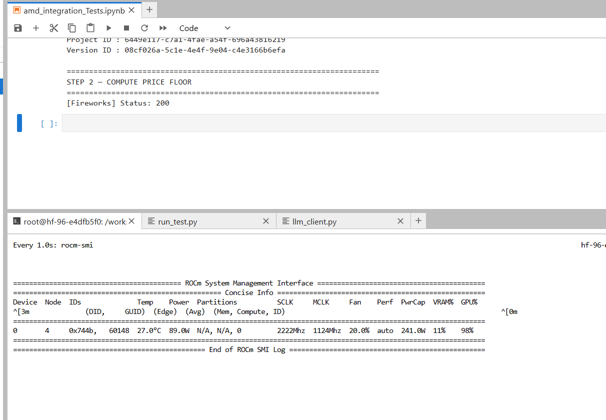
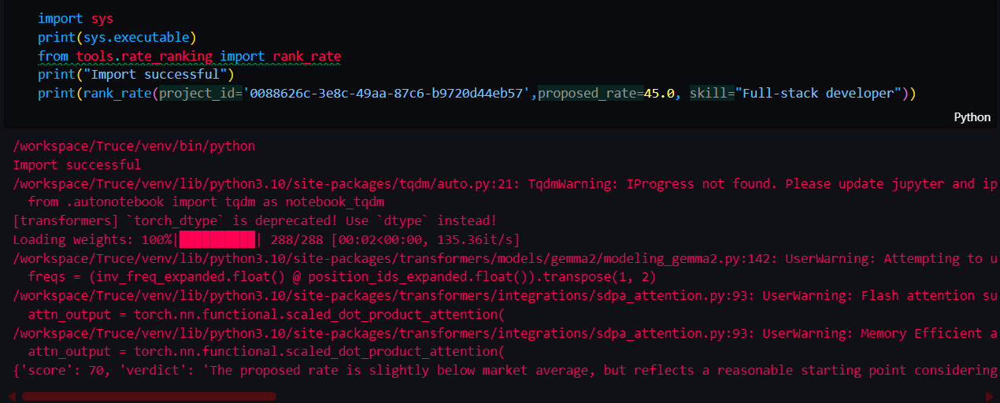

# Truce

**One conversation. One trusted contract.**

*AI-mediated scoping and negotiation infrastructure for freelance and small-agency work — built for the AMD Developer Hackathon: ACT II · Unicorn Track.*

[]()
[]()
[]()

> 📊 For market sizing, business model, and the full AMD + Gemma strategic case, see [`BUSINESS_CASE.md`](./BUSINESS_CASE.md).

---

## The problem

Freelance work doesn't fail for lack of freelancers or clients. It fails from four things nobody catches until it's too late: unclear requirements, scope creep, underpriced or over-budget deals, and lost deals from misalignment on availability or terms. These aren't edge cases — they're the default failure mode of independent work:

| Metric | Value | Source |
|---|---|---|
| Projects that experience scope creep | **52%** | PMI, *Pulse of the Profession* |
| Project failures where unclear/inaccurate requirements are a cited cause | **39%** | PMI, *Pulse of the Profession* |
| Freelance-specific projects affected by scope creep | **~72%** | Freelance-market research (higher than PMI's cross-industry baseline, which assumes formal PM structure freelance work rarely has) |
| Unbilled hours absorbed per project by freelancers | **20–40 hrs** | Freelance-market research |
| Resulting lost income for a $100/hr freelancer | **~$24,000/yr** | Derived from the unbilled-hours figure above |

This is a quantified, chronic tax on independent work — not a niche complaint. The intervention Truce automates isn't invented: documented best practice for controlling scope creep is an explicit inclusion/exclusion scope statement paired with a formal change-request process — exactly the two mechanisms this pipeline generates by default.

## The idea

Truce gives both sides of a freelance transaction an intelligent representative. A **Client Agent** understands goals and constraints, a **Freelancer Agent** evaluates feasibility and fair pricing, and a **Mediator Agent** runs a bounded, capped negotiation between them. The output is a single, transparent, human-approved contract — before a single billable minute begins.

A client or freelancer describes a project once. Truce extracts structured requirements, asks for clarification wherever it's unsure instead of assuming, generates an included/excluded scope document with a transparent risk score, sets fair pricing boundaries, negotiates only where needed, and outputs a signed contract with milestones.

## What already exists — and where it stops

| Category | Examples | The gap |
|---|---|---|
| Freelance paperwork tools | Bonsai, HoneyBook (500K+ freelancers, $15–39/mo) | Template-only — no AI extraction, no gap detection, no risk scoring, no negotiation. Reviewers of both tools note they "slow agencies down" once a team outgrows templates — a real gap upmarket |
| Enterprise CLM software | Multi-billion-dollar category, 9–18% CAGR | Proves the discipline is worth real money — but priced and built only for enterprises with legal departments |
| AI negotiation agents | Pactum ($20M raised, Maersk among backers; works with Walmart, Vodafone) | Proves bounded-autonomous negotiation is fundable at scale — but never brought down to individual-scale gig work |
| Fee-fairness platforms | Contra ($50M raised, commission-free freelancing), Braintrust (flips who pays the platform fee; works with Porsche and Nestle) | Proves people switch for a fairer deal — but neither does scoping or negotiation |

Each of these solves one slice, for one market. Freelancers and small agencies face all four problems at once and don't want seven different tools — they want one. Nobody has stacked scoping + pricing + negotiation + contracting into one workflow for individual-scale work — that's the gap Truce fills.

## What this MVP actually does

- **Structured extraction** — a Client Agent parses a free-text project brief into deliverables, must-haves, nice-to-haves, and constraints, and flags anything ambiguous for clarification rather than guessing.
- **Scope document** — an included/excluded scope statement with a rule-based risk score.
- **Pricing floor** — a Freelancer Agent reasons a fair minimum rate against a set of comparable market rates, with a transparent, visible reasons list (never an opaque number).
- **Bounded negotiation** — a Mediator Agent runs a capped, deterministic negotiation between the client's budget ceiling and the freelancer's price floor. Round limits and threshold enforcement live in plain Python, not in model judgment.
- **Contract generation** — once negotiation converges, a PDF contract (scope, pricing, milestones, signatures) is generated and stored, with a built-in change-order process.
- **Human approval throughout** — no agent action finalizes a deal or moves money. Every consequential step is reviewed by a human in the loop, in plain language.

This is the **Layer 1 (Scoping & Negotiation)** slice of a larger planned product, scoped intentionally for the hackathon timeframe. No money moves in this MVP.

## Why this is hard to fake

- **Multi-agent design** — separate Client, Freelancer, and Mediator agents with distinct, sometimes competing objectives. Not one model roleplaying both sides.
- **Deterministic guardrails** — negotiation is capped and bounded in code, never left purely to model judgment.
- **Schema-validated everything** — every agent output is validated JSON (Pydantic), never trusted as free text into a contract.
- **Transparent scoring** — pricing and risk scores ship with a visible reasons list, not an opaque number.

## How it works

```
1. Describe the project once
2. Client Agent extracts structured requirements — asks when something's unclear, rather than assuming
3. A scope document (included/excluded) is generated for both sides
4. Freelancer views the fully scoped document and sets a price
5. Fair pricing boundaries are researched; a confidence score is given against market comparables
6. A bounded, capped negotiation runs only where price or scope don't align
7. One signed contract is produced, with a built-in change-order process
8. Both sides review and approve in plain language before anything is final
```

**Invariant across every stage:** every agent output is schema-validated JSON (via Pydantic models in `models/schemas.py`), never trusted as free text. No agent action finalizes a deal or moves money — humans approve every consequential step.

### Agents

| Agent | File | Responsibility |
|---|---|---|
| Client Agent | `agents/client_agent.py` | Extracts and clarifies requirements, sets budget ceiling and priorities |
| Freelancer Agent | `agents/freelancer_agent.py` | Researches market rate for skill/experience tier, sets price floor with reasoning |
| Mediator Agent | `agents/mediator_agent.py` | Runs the capped, bounded negotiation between floor and ceiling |

### Orchestration

`crew.py` sequences the three agents (Client → Freelancer → Mediator). CrewAI is used as the orchestration framework for this hackathon/MVP scope.

## AMD + Gemma: what's actually running on the GPU

Truce runs a hybrid AI stack: **Fireworks** as the primary remote LLM (hackathon credits), **Groq** as an automatic fallback for reliability, and a **local Gemma 2B model loaded directly onto an AMD GPU** (`device_map="cuda"` via ROCm/PyTorch) for a specialized rate-ranking feature. This isn't an API call to a hosted endpoint — the model weights are loaded onto the AMD Radeon GPU itself, and every rate is scored 0–100 against market comparables entirely on-device.

This demonstrates the architectural path the product is built toward: sensitive pricing and negotiation signals processed **locally**, without sending proprietary business data to an external API. The full strategic rationale, target workloads for local inference, and roadmap live in [`BUSINESS_CASE.md`](./BUSINESS_CASE.md).

## Tech stack

- **Frontend/App:** Streamlit
- **Agent orchestration:** CrewAI
- **LLM inference:** Fireworks AI API (primary), Groq (fallback), local Gemma 2B on AMD GPU / ROCm (rate ranking)
- **Database & file storage:** Supabase (Postgres + Storage)
- **PDF generation:** ReportLab
- **Validation:** Pydantic

## Important disclaimers

**Market-rate data is static, not live.** The comparable rates used by the Freelancer Agent come from a curated, offline snapshot dataset (`tools/data/comparables.json`), not a live scrape or real-time feed. This was a deliberate MVP tradeoff — live scraping is fragile and adds demo risk with no upside for judging. Swapping in a real, continuously-updated pipeline is a scoped post-hackathon task that only touches `tools/market_research.py`.

**Negotiation is a simulation of the mechanic, not financial advice.** The bounded negotiation logic demonstrates a deterministic, auditable approach to closing a price gap. Pricing outputs should be treated as a starting point for human review, not a final number.

**No money movement in this MVP.** Escrow/payment execution is explicitly out of scope for this submission and would require real regulatory review (payment processor licensing, cross-border FX compliance) before any code is written.

**Local GPU-based rate ranking requires CUDA/ROCm hardware.** `tools/rate_ranking.py` loads and runs a local Gemma model (`google/gemma-2-2b-it`) directly on GPU (`device_map="cuda"`) as part of the freelancer pricing flow. This path was built and tested on an AMD GPU pod and will not run on CPU-only free hosting tiers (e.g. Streamlit Community Cloud, Hugging Face Spaces free tier) without modification — see **Deployment** below.

**Proof of AMD usage in AMD pod**:


Checkout [`amd_integration_Tests.ipynb`](./amd_integration_Tests.ipynb) to see how rate_ranking works:


**Authentication is custom, not Supabase Auth.** Login uses a simple email/password + bcrypt scheme with session state managed by Streamlit — Supabase is used purely as a Postgres database and file store, not for identity. Row Level Security policies should be configured with this in mind (see `db/client.py`, `auth/session.py`).

## Setup

### 1. Clone and install dependencies

```bash
git clone <this-repo-url>
cd truce
pip install -r requirements.txt
```

> **Note:** `requirements.txt` is trimmed for general deployment (no heavy local-inference libraries). For the local Gemma rate-ranking path (GPU required), use `requirements-amd.txt` instead, which includes `transformers`, `accelerate`, `bitsandbytes`, and `safetensors`.

### 2. Configure environment variables

```bash
cp .env.example .env
```

| Variable | Description |
|---|---|
| `SUPABASE_URL` | Your Supabase project URL |
| `SUPABASE_KEY` | Supabase API key (see note below on RLS) |
| `LLM_BASE_URL` | Base URL for the remote LLM API (e.g. Fireworks AI) |
| `LLM_API_KEY` | API key for the remote LLM |
| `LLM_MODEL_ID` | Model identifier to use for remote calls |
| `NEGOTIATION_ROUND_CAP` | Hard cap on negotiation rounds (int) |
| `FIREWORKS_API_KEY` | Fireworks AI API key |
| `CLIENT_PROFILE_ID` | Demo/default client profile ID used by the MVP |
| `LOCAL_GEMMA_MODEL_ID` | *(optional)* Local Gemma model ID for GPU-based rate ranking |

**On `SUPABASE_KEY`:** since this app does not use Supabase Auth, using the `service_role` key is the simplest way to ensure database/storage calls succeed if Row Level Security is enabled. Treat this key as a server-side secret only , never expose it to a browser/client context.

### 3. Set up the database

Provision the required tables and a private Supabase Storage bucket named `contracts`. Schema setup is not automated in this MVP — see `db/operations.py` for the expected table/column shapes.

### 4. Run locally

```bash
streamlit run app.py
```

## Deployment

This app runs as a single Streamlit process, agent orchestration happens in-process, not on a separate server. It can be deployed on any host that runs Streamlit apps with Python dependencies and environment secrets:

- **Streamlit Community Cloud** (free) — point it at `app.py`, add secrets matching the `.env` variables above.

**GPU-dependent features will not work on free CPU-only hosting.** The local Gemma rate-ranking path in `tools/rate_ranking.py` requires an actual CUDA/ROCm-capable GPU. For deployment on non-GPU infrastructure, either route rate ranking through the remote Fireworks API instead of local inference, or accept that this feature is limited to GPU-backed environments (e.g. the AMD Developer Cloud pod used during development).

## Testing

```bash
python run_tests.py
```

Covers the Client Agent, Freelancer Agent, Mediator Agent, and an end-to-end pipeline smoke test. Deterministic/procedural logic paths are tested directly; LLM-dependent behavior is validated against schema conformance rather than exact output matching, since model outputs are non-deterministic by nature.

## Project structure

```
agents/          Agent logic
auth/            Custom session-based authentication
config/          Environment-driven settings
crew.py          Sequential pipeline orchestration
db/              Supabase client and query operations
models/          Pydantic schemas for all agent I/O
tools/           LLM client, contract generator, market research, rate ranking
ui/              Streamlit pages and components
tests/           Unit and end-to-end pipeline tests
```

## Market opportunity

Hundreds of millions of freelancers globally, proven willingness to pay by adjacent tools (Bonsai/HoneyBook: 500K+ freelancers), and a horizontal problem — scope creep looks the same in Karachi, Manila, São Paulo, or Berlin.

## Vision forward

Get the backend right first. Improve the frontend. Then Truce becomes the trusted layer the next freelancing ecosystem gets built on — with more of the agent pipeline shifted to private, local AMD-accelerated inference over time, reducing cost and keeping sensitive commercial data off external APIs.

## Team

Built by **Duaa Siraj** and **Laiba Ashfaq** for the AMD Developer Hackathon: ACT II · Unicorn Track.

## License

MIT (per hackathon submission requirements).